# IDOFactory

White-label Decentralized IDO Launchpad Platform

## Installation

1. Install dependencies

    ```bash
    yarn
    ```

2. Start app

    ```bash
    yarn start
    ```

Open [http://localhost:3000](http://localhost:3000) with your browser to see the result.

## Launch and Setting Up Application

[Read](./docs/launchAndSettingUp.md)

## Add a new EVM-like chain

[Read](./docs/addNewNetwork.md)

## Images

1. Home page
    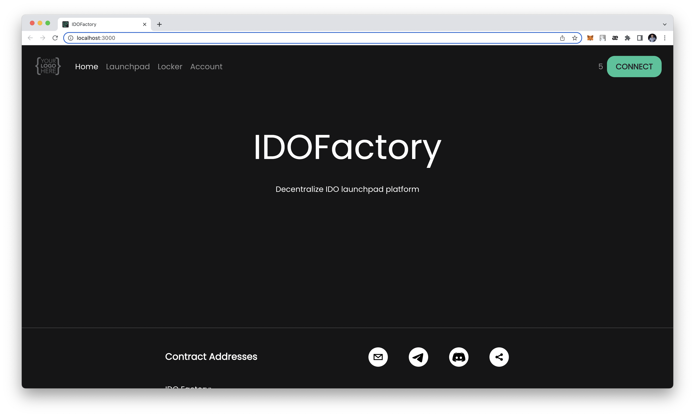
1. Launchpad page
    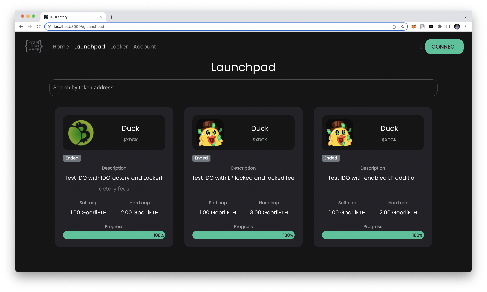
1. IDO info pages
    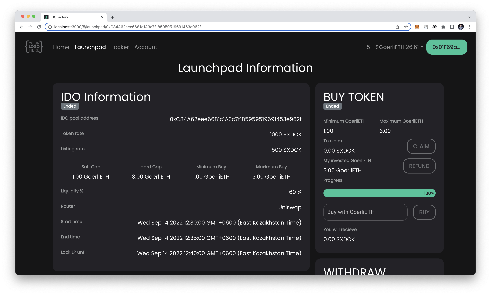
    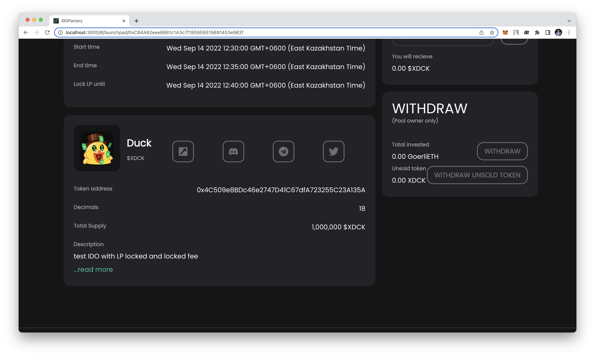
1. Locker page
    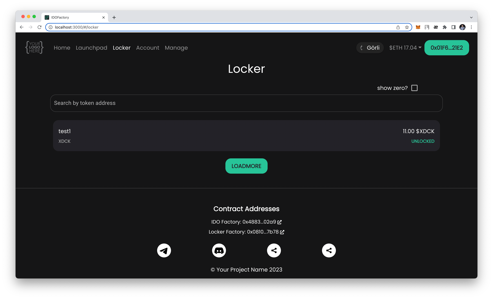
1. Locker info page
    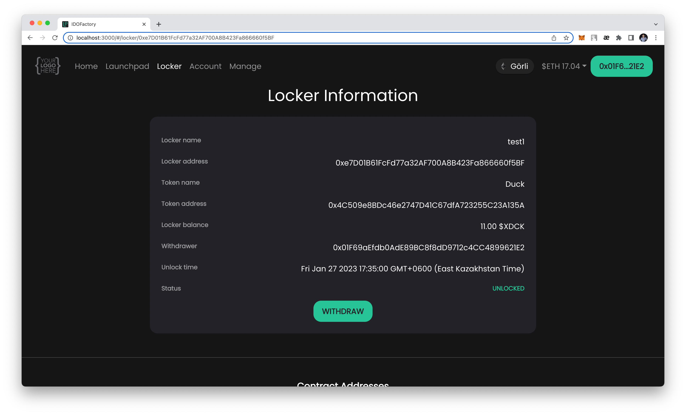
1. Account page
    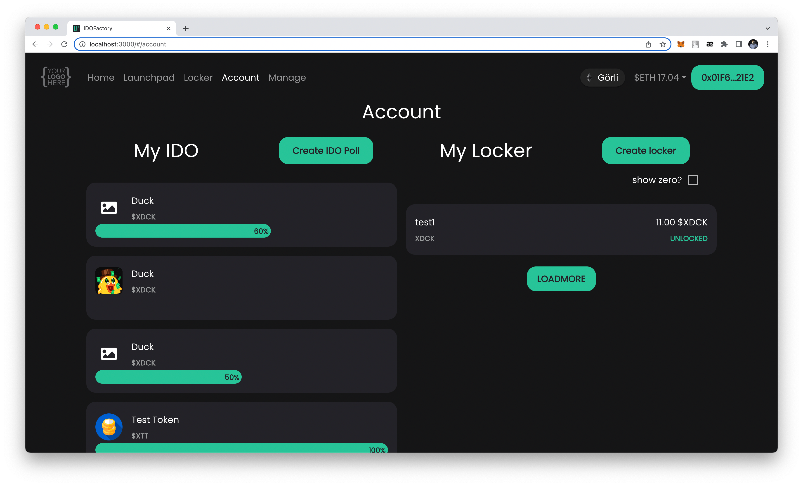
1. Create Launchpad Pool pages
    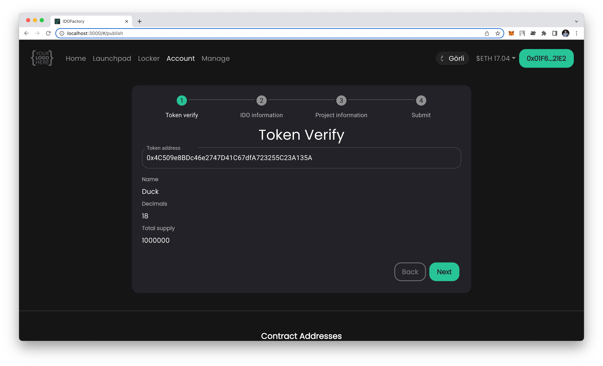
    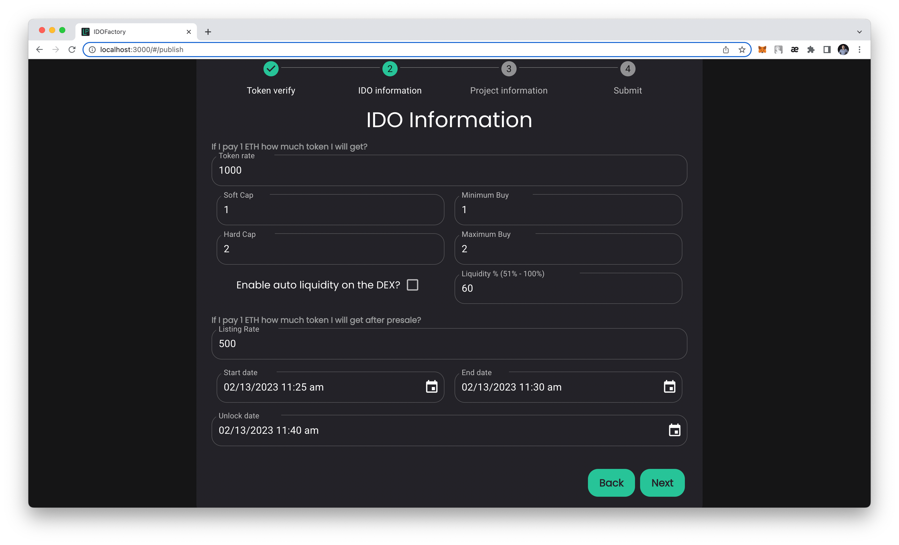
    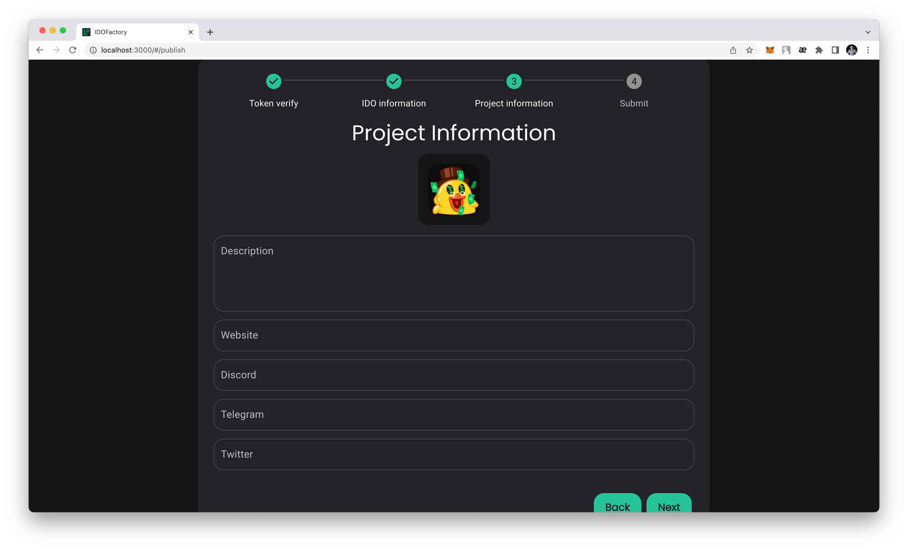
    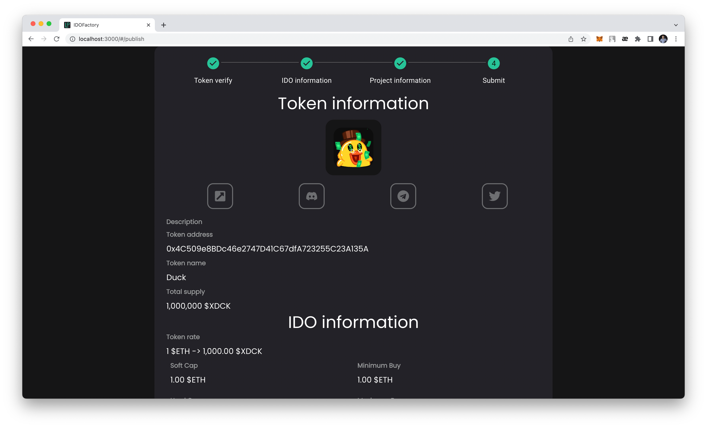
    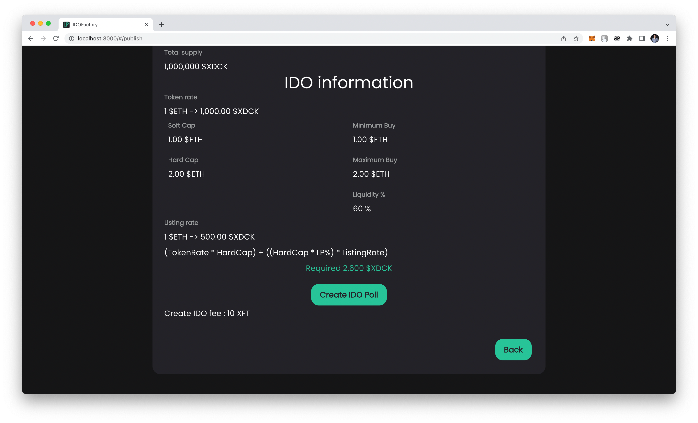
1. Lock Token page
    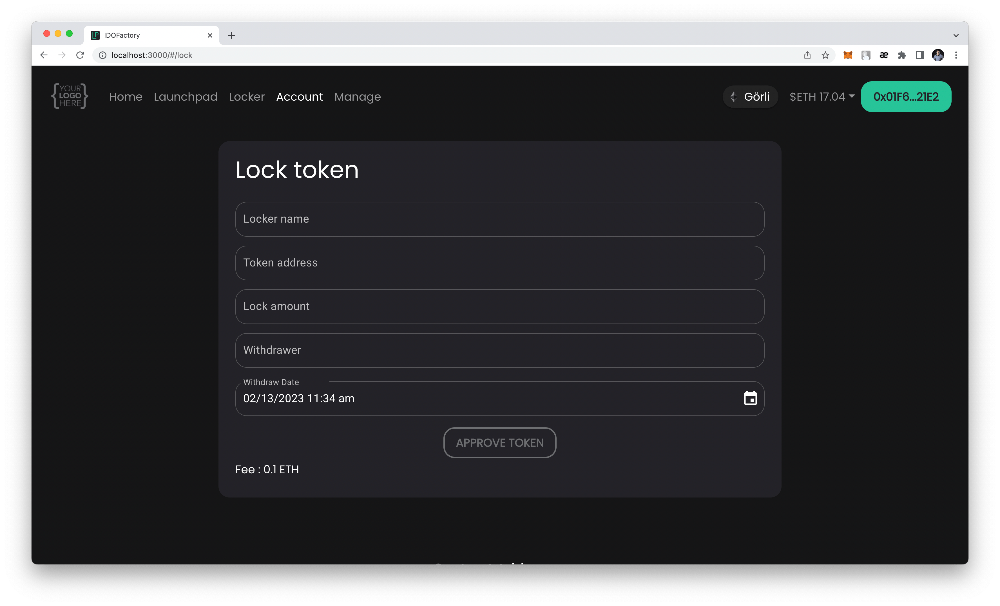
